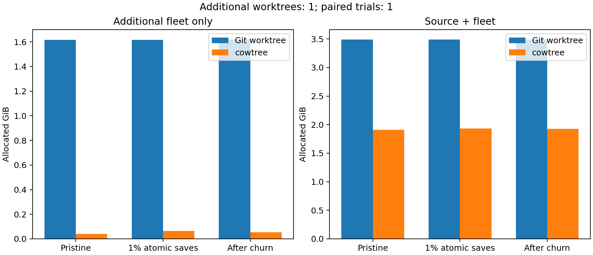

# Physical APFS worktree benchmark

1 paired trials; 1 additional worktrees; source `adc218676eef25575469234709c2d87185ca223a`.

| Stage | Git fleet GiB | cowtree fleet GiB | Fleet saving | Total saving |
|---|---:|---:|---:|---:|
| Pristine | 1.616 | 0.041 | 97.48% | 45.18% |
| 1% atomic saves | 1.617 | 0.063 | 96.09% | 44.54% |
| After churn | 1.620 | 0.053 | 96.70% | 44.87% |

Fleet savings = 1 - (cowtree stage - cowtree source) / (Git stage - Git source). Total savings subtract each empty filesystem instead. All numbers include APFS metadata and Git indexes. The source checkout and Git object database are counted once in total footprint. Later stages also include metadata written by earlier Git status checks.

Container allocation is sampled after normal detach/reattach; the sparse image's allocation is retained separately as a host high-water footprint. Operation timings exclude checkpoints and verification.

A seeded 1% sample of tracked regular C/header files receives atomic saves. Two rounds remove half the fleet (at least one tree), recreate it and append comments to another 1% sample. The second round deletes one directory externally before API cleanup. Both arms must have identical operation results and state digests.

Full manifests check source and every leaf before edits and after final churn. Intermediate checks hash every edited path plus approximately 128 clean paths in each tree. Checks cover content, modes, symlinks, HEAD, dirty paths and registry. This is sequential fault-injection testing; it does not prove crash consistency, concurrent linearizability, or successful builds of modified Linux sources.

## Operation and backing-image evidence

| Trial | Method | Create seconds | Peak image GiB | Cleanup residual MiB |
|---|---|---:|---:|---:|
| 0 | git | 26.56 | 3.706 | 6.195 |
| 0 | cowtree | 188.26 | 2.025 | 12.102 |

Images retain allocation after deletion; no image compaction was performed. Cleanup residual includes retained filesystem and Git metadata after all leaf registrations and directories have been verified absent. Timing includes sparse-image I/O and unrelated host load; it does not establish native-volume speed. Trial 0 runs Git first; additional trials alternate arm order.
