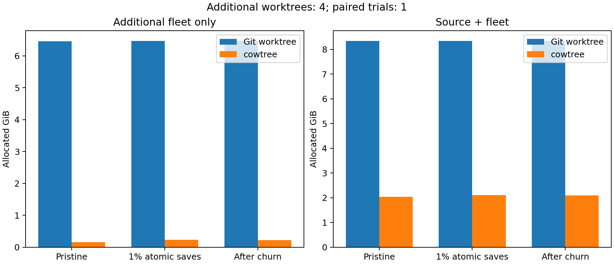

# Physical APFS savings on Linux v6.12

Cowtree saves real disk space. This workload does not support a 99% physical-space claim.

| Additional trees | Stage | Git GiB | cowtree GiB | Additional-tree saving | Source + fleet saving |
|---:|---|---:|---:|---:|---:|
| 1 | Pristine | 1.616 | 0.041 | 97.48% | 45.18% |
| 1 | 1% C/header atomic saves | 1.617 | 0.063 | 96.09% | 44.54% |
| 1 | After two churn rounds | 1.620 | 0.053 | 96.70% | 44.87% |
| 4 | Pristine | 6.464 | 0.163 | 97.47% | 75.60% |
| 4 | 1% C/header atomic saves | 6.466 | 0.238 | 96.32% | 74.71% |
| 4 | After two churn rounds | 6.473 | 0.223 | 96.55% | 74.90% |

**Scope:** one matched pair per fleet size, both Git first; seed 1729. No repeat statistics or native-volume speed claim. Timings include sparse-image I/O and unrelated host load.

**Input:** [Linux v6.12](https://github.com/torvalds/linux/tree/adc218676eef25575469234709c2d87185ca223a), 86,680 files, 1,476,500,559 tracked bytes, 62 symlinks. Samples select 600 of the 59,953 regular C/header files per leaf. Each pair applies identical seeded edits and victim choices.

**Runtime:** cowtree `f97d7ccc8ff784689ac077af5e782296d0c752d2`, identical runtime sources to merged PR #1. macOS-26.5.2-arm64-arm-64bit; Apple M5 Max; 48 GiB RAM; Python 3.10.20; git version 2.50.1 (Apple Git-155).

**Measurement:** private case-sensitive APFS images on this Mac. Case sensitivity preserves 13 groups of case-colliding Linux paths. Normal detach/reattach flushes deferred allocation; three equal container-used samples are required. Empty-image and source-only baselines separate additional-tree costs from total footprint. Filesystem metadata and Git indexes count. Later stages include metadata written by preceding Git status checks. Per-file du is not used.

**Meter check:** a dense 128 MiB file clone added 16 KiB; overwriting 1 MiB added about 1 MiB; ordinary copy added about 128 MiB. Repeated unchanged mount checkpoints drifted 8 KiB. See [calibration](checkpoint-calibration.json).

**Correctness:** full byte/mode/symlink/path inventories before edits and after final churn, plus complete source verification after cleanup. Intermediate checks cover every edited file and roughly 128 clean paths per tree, HEAD, dirty paths, and the exact registry. Both arms must produce equal operation results and state digests. Original slot 1 survives both four-tree churn rounds with its edits; one other directory is deleted externally before API cleanup.

All histories passed: 1,816 operations per arm in the pilot, 7,226 per arm in the four-tree run. The final four-tree check hashed 433,400 files and verified 4,182 changed leaf files. Every leaf directory and corresponding registration was removed; source file hashes stayed unchanged.

**Limits:** sequential lifecycle fault injection, not a concurrent linearizability test or process/power-crash recovery proof. Modified Linux sources were not compiled. Savings depend on file sizes, edit strategy and churn; a universal 99% does not follow from avoiding file-content copies.

Detailed receipts: [one-tree run](pilot/report.md), [four-tree run](fleet/report.md). The JSON files preserve all allocation samples and verification summaries. raw-sha256.json identifies the complete raw manifest/history archive; exported metadata removes absolute local paths.

Reproduce with [the benchmark instructions](../../README.rst). The CLI defaults to three paired trials with alternating arm order; the recorded runs explicitly used --trials 1.
